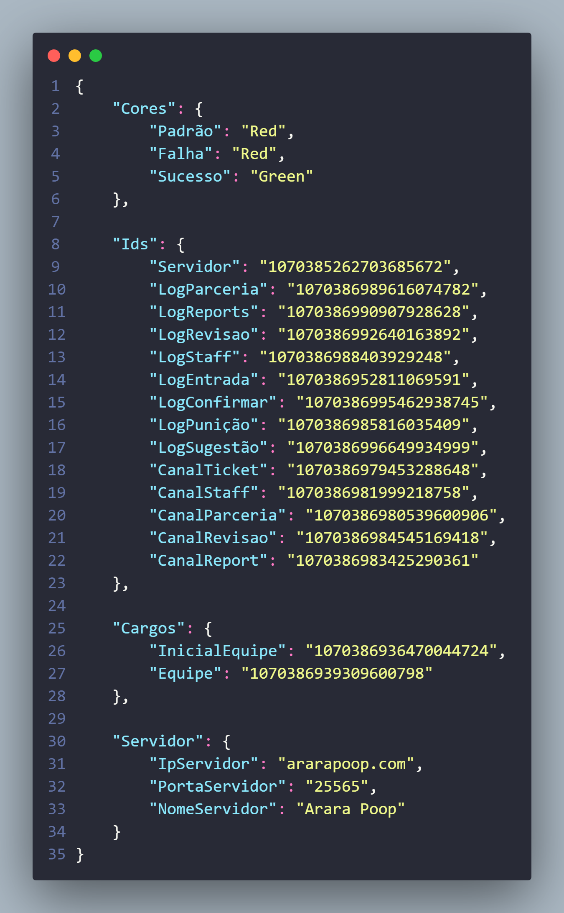

# ⚙ Configurando o LuckyLicense

## Configurando seu produto com LuckyLicense

Gerenciando seu produto poderá observar que existe algumas opções como: arquivo de configuração e iniciar/desligar/reiniciar aplicação, tudo isso faz parte do LuckyLicense. Abrindo o arquivo de configuração deverão ver algo parecido com isso:

<figure><figcaption></figcaption></figure>

Esse arquivo json é onde irá configurar sua aplicação, basta fazer o que indica os comentários (não presentes nessa imagem) que irá conseguir iniciar sua aplicação com sucesso! Isso é padrão: a primeira alteração sempre levará mais tempo para ser salva, porém as próximas serão instantâneas, qualquer dúvida basta abrir um ticket que nossa equipe irá te ajudar com todas as suas dúvidas.
